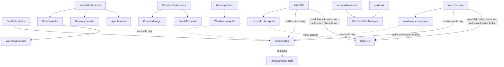

# Orchestration Hierarchy

This document defines the current ownership boundaries for AIOX orchestration
modules and the lifecycle status of legacy workflow scripts.

## Decision Summary

New durable story and epic orchestration state must use
`.aiox-core/core/orchestration/session-state.js`.

Lean Full SDC and Wave Execute may keep synchronous, recoverable execution
journals under `.aiox/sdc/` and `.aiox/waves/`. These checkpoints are local
caches, not lifecycle authorities. The story file remains canonical for story
status and QA evidence, while `SessionState` remains canonical for durable
orchestration context. Conflict precedence, recovery, retention, and synchronous
compatibility are defined by
[ADR: SDC and Wave Checkpoint Ownership](adr/ADR-SDC-WAVE-CHECKPOINT-OWNERSHIP.md).

`.aiox-core/development/scripts/workflow-state-manager.js` is deprecated for new
lifecycle work. It remains available only for legacy guided workflow tasks and
`*next` compatibility until those entry points are migrated.

`.aiox-core/development/scripts/workflow-navigator.js` is not deprecated. It is
an active read-only suggestion helper and must not become the owner of persisted
state.

## Module Boundaries

| Module | Status | Owns | Should Be Used For | Should Not Be Used For |
| --- | --- | --- | --- | --- |
| `BobOrchestrator` | Active | Project-state decision tree for Bob/PM flows | Greenfield and brownfield routing, story-driven development orchestration, observability callbacks | Generic YAML workflow execution or ADE Epic 0 compatibility |
| `MasterOrchestrator` | Active legacy/ADE | Epic 0 autonomous development pipeline | Coordinating ADE epics, gates, recovery, and agent invocation | Bob project-state routing or new Bob session persistence |
| `WorkflowOrchestrator` | Active | Generic YAML workflow execution | Multi-agent workflow phases loaded from workflow YAML | Bob decision-tree routing or story/epic session persistence |
| `SessionState` | Canonical | Persistent epic/story orchestration state | Crash recovery, Bob progress tracking, story/epic resume state | Establishing lifecycle status without the story file; stateless command suggestions |
| `WorkflowNavigator` | Active helper | Command suggestions from workflow patterns and context | Greeting-time suggestions, next-step hints, read-only navigation | Persisting or mutating workflow/story state |
| `WorkflowStateManager` | Deprecated compatibility | Legacy guided workflow state files | Existing `run-workflow`, `run-workflow-engine`, and `next` compatibility | New Bob, story, or epic lifecycle state |
| Lean SDC checkpoint | Active operational journal | Local SDC phase results, retries, and resume hints | Recovering the current local Full SDC execution | Establishing story status, QA approval, or durable orchestration truth |
| Wave checkpoint | Active operational journal | Local wave plan, batches, child summaries, and fan-in progress | Recovering the current local Wave Execute run | Establishing child story completion, epic completion, or canonical current-story selection |

## State Ownership

| State Surface | Owner | Path | Notes |
| --- | --- | --- | --- |
| Bob/story/epic session state | `SessionState` | `docs/stories/.session-state.yaml` | Canonical for new persistent orchestration state; lifecycle fields mirror the story file |
| Story status and QA evidence | Authorized role through the story file | Bound `*.md` story file | Canonical lifecycle and audit record; approved QA review establishes `Done` |
| Lean SDC execution checkpoint | Lean SDC progress helper | `.aiox/sdc/{story-id}/state.json` | Gitignored, reconstructible local journal; never wins a canonical conflict |
| Wave execution checkpoint | Wave progress helper | `.aiox/waves/{wave-id}/state.json` | Gitignored, reconstructible local journal; never wins a canonical conflict |
| Legacy guided workflow state | `WorkflowStateManager` | `.aiox/{instance-id}-state.yaml` | Deprecated compatibility surface |
| Legacy workflow-state directory | `SessionState` migrator | `.aiox/workflow-state/` | Migration input for ADR-011 compatibility |
| Contextual command suggestions | `WorkflowNavigator` | None | Reads patterns/context and returns suggestions only |

## Import Rules

- New orchestration code must import `SessionState` for persistent story or epic
  orchestration state.
- New code may import `WorkflowNavigator` only for read-only command suggestions.
- New imports of `workflow-state-manager.js` are allowed only when maintaining
  legacy `run-workflow`, `run-workflow-engine`, or `next` compatibility.
- Synchronous SDC and wave checkpoint helpers may write only their local JSON
  journals. They must not parse or write `.session-state.yaml` directly.
- Synchronization from a checkpoint into durable orchestration context must use
  the asynchronous `SessionState` API at an orchestration boundary.
- A local checkpoint must be reconciled against the story file and
  `SessionState` before resume or dependent model dispatch. Stale or forged
  checkpoint completion cannot advance lifecycle state.
- Task files that reference `workflow-state-manager.js` must include a fallback
  note pointing new lifecycle work to `session-state.js`.
- No orchestration module should import deprecated state helpers without a
  compatibility reason documented near the reference.

## Current Relationships

## Migration Guidance

When touching legacy-guided workflow execution, keep changes narrow and preserve
compatibility. Do not rename legacy state files unless the caller has an
explicit migration path.

When building new Bob or story-driven development behavior, skip
`WorkflowStateManager` entirely. Store durable orchestration context through
`SessionState`; record lifecycle status and its evidence in the story file
through the authorized role.

When resuming Full SDC or Wave Execute, first validate the bound story file,
then load `SessionState`, and only then use the local checkpoint as a resume
hint. If the checkpoint disagrees with canonical status, QA evidence, or durable
session context, rewind, rebuild, or discard the checkpoint. Do not dispatch
dependent work until required canonical synchronization succeeds.
